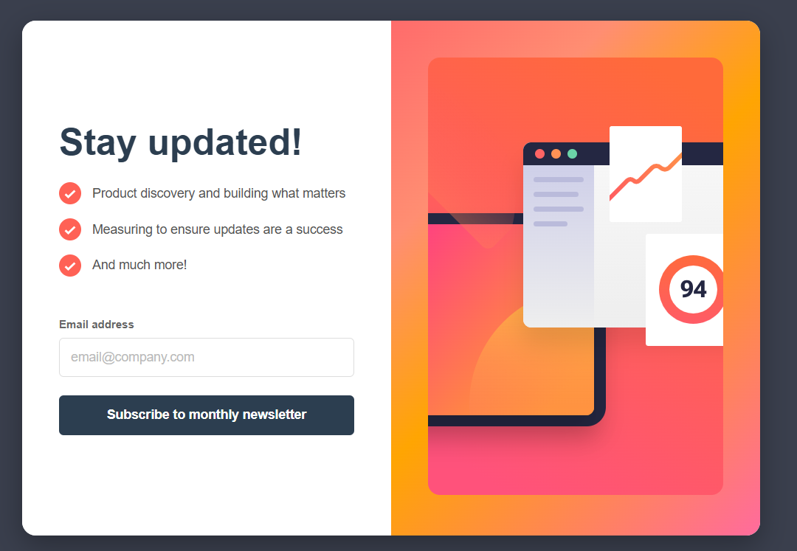
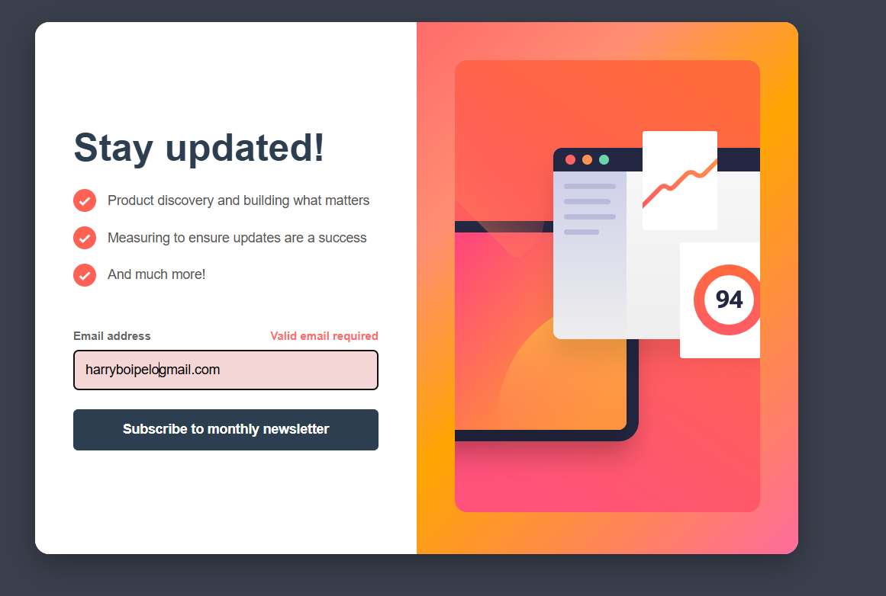
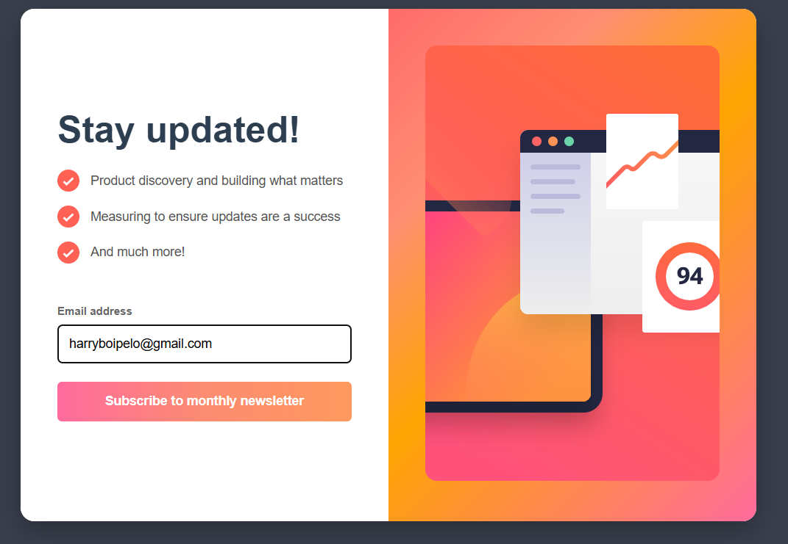
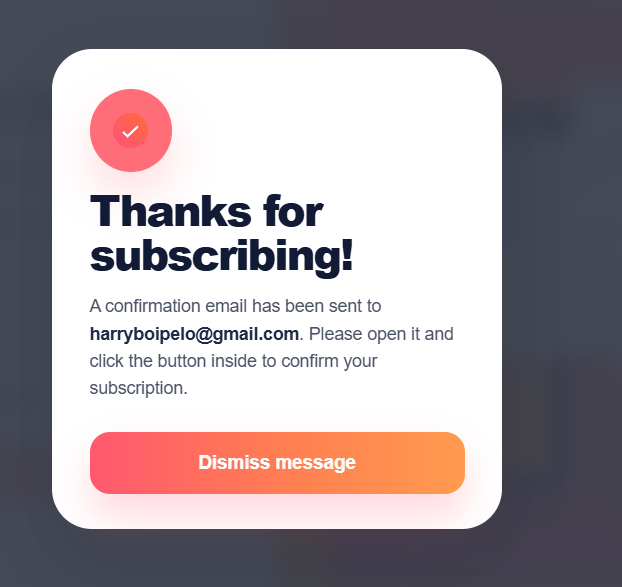

# Frontend Development Project

A simple frontend project containing:

- `index.html` — main HTML file
- `styles.css` — styling for the page
- `script.js` — JavaScript functionality

## Getting Started

Open `index.html` in a web browser to view the project.

## Development

1. Edit `index.html`, `styles.css`, or `script.js`.
2. Refresh the browser to see changes.

## Features

Users are able to:
 
- Enter their email address and submit the form
- See a success message displaying their email after a successful submission
- See validation error messages if:
  - The email field is left empty
  - The email address is not formatted correctly
- View the optimal layout depending on their device screen size
- See hover and focus states for all interactive elements
---
 
### Screenshot






---
 
### Links
 
- **Live Site:** [View Live](https://boipelo-85.github.io/Frontend-Development/)
- **Repository:** [GitHub Repo](https://github.com/Boipelo-85/Frontend-Development.git)
---
 
## My Process
 
### Built With
 
- HTML
- CSS (Media Queries)
- JavaScript
---
 
### What I Learned
 
Working on this project helped me practice and improve my skills in:
 
- **Form validation** using JavaScript — checking for empty fields and valid email formats using regex
- **Conditional rendering** — showing and hiding the success message based on form submission
- **Responsive design** — using media queries to switch the layout from side-by-side on desktop
- **CSS** — for structuring the two-column layout cleanly
One key thing I learned was how to properly center an absolutely positioned icon using:
 
```css
left: 50%;
transform: translateX(-50%);
```
---
 
### Continued Development
 
In future projects I want to:
 
- Improve my CSS animation skills to add smoother transitions between the form and success message
- Explore form validation using HTML built-in attributes
- Practice building more components with a mobile-first approach from the start
---
 
## Author
 
- **Name:** Boipelo Harry Motileng
- **Frontend Mentor:** [@boipelo](https://boipelo-85.github.io/Frontend-Development/)
- **GitHub:** [github.com/boipelo](https://github.com/Boipelo-85)
- **LinkedIn:** [linkedin.com/in/boipelo](https://www.linkedin.com/in/boipelo-motileng)
---
